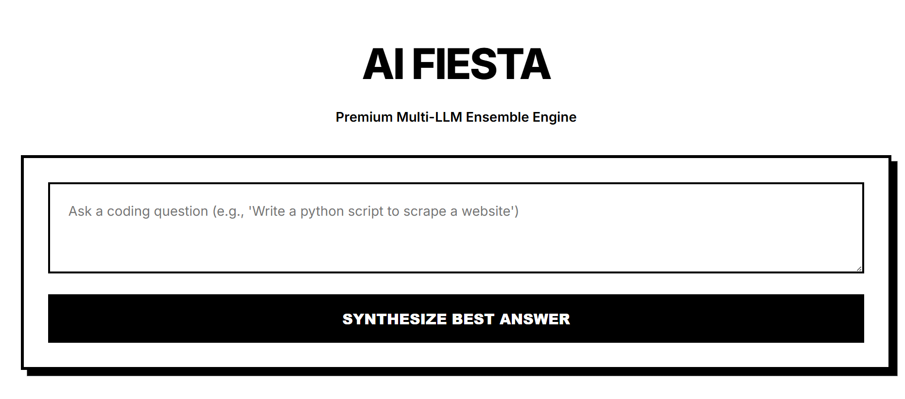
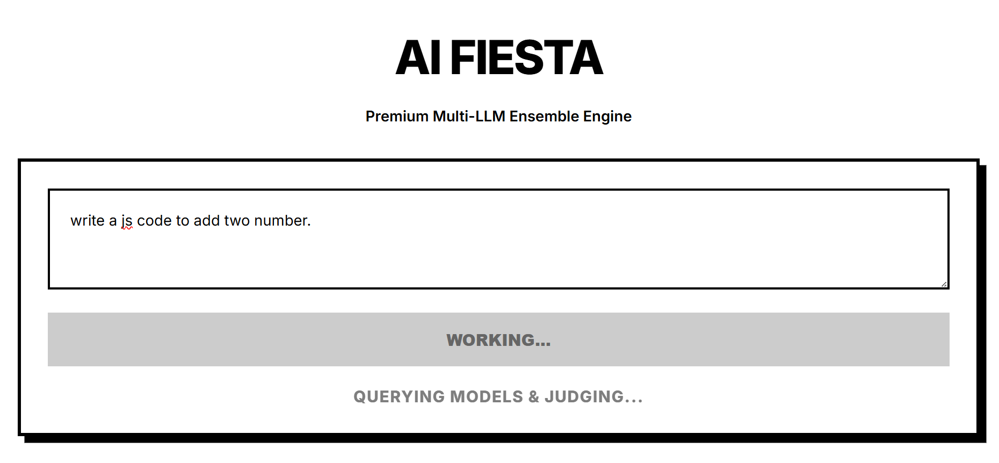
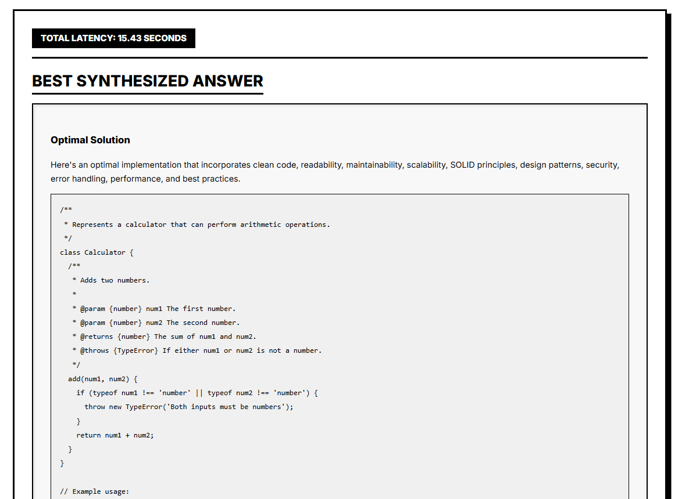
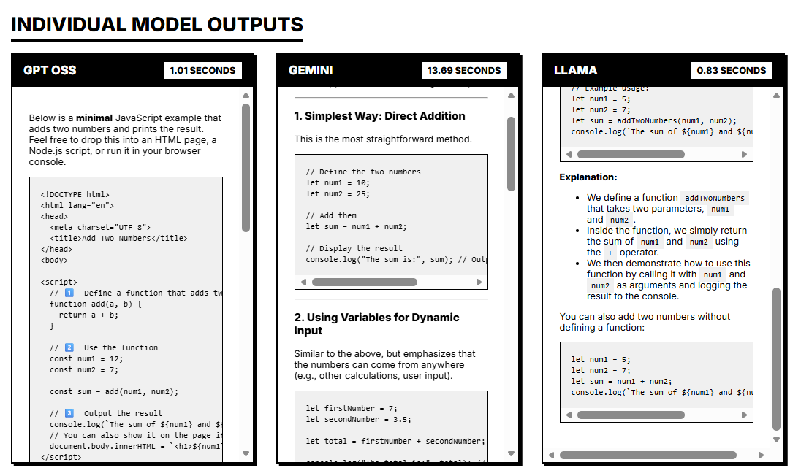
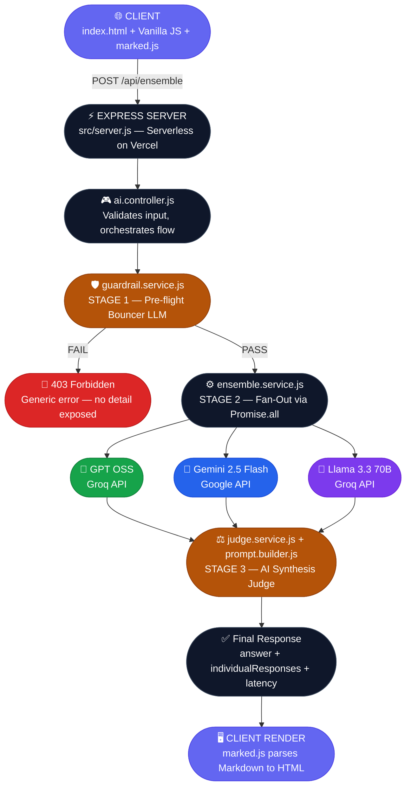

<h1 align="center">
  <br>
  🎉 AI Fiesta
  <br>
</h1>

<h4 align="center">A Premium Multi-LLM Ensemble Engine that queries multiple frontier AI models in parallel and synthesizes their outputs into one superior, optimized answer.</h4>

<p align="center">
  <a href="https://ai-fiesta.ashaaf.in/" target="_blank">
    
  </a>
  
  
  
  
</p>

<p align="center">
  <a href="#-live-demo">Live Demo</a> •
  <a href="#-what-is-ai-fiesta">What is AI Fiesta?</a> •
  <a href="#-system-architecture">System Architecture</a> •
  <a href="#-engineering-deep-dive">Engineering Deep Dive</a> •
  <a href="#-the-guardrail-system">Guardrail System</a> •
  <a href="#-getting-started">Getting Started</a>
</p>

---

## 🔗 Live Demo

> **[https://ai-fiesta.ashaaf.in/](https://ai-fiesta.ashaaf.in/)**

---

## 📸 Screenshots

### 1. Home Page


### 2. Querying Models & Judging


### 3. Best Synthesized Answer


### 4. Individual Model Outputs


---

## What is AI Fiesta?

AI Fiesta is not just another AI chatbot. It is a **Multi-LLM Ensemble Engine** - a system that orchestrates multiple frontier AI models simultaneously and uses a dedicated **AI Judge** to synthesize their individual responses into a single, superior answer.

The philosophy: **No single model is perfect.** GPT OSS might write cleaner code while Llama 3 might have better reasoning and Gemini excels at structure. AI Fiesta extracts the best of all three, every single time.

### Key Features

| Feature | Description |
|---|---|
| **Parallel Model Execution** | All 3 LLMs are queried simultaneously using `Promise.all`, not sequentially |
| **AI Judge & Synthesizer** | A 4th LLM evaluates and synthesizes all responses into one optimal answer |
| **Intelligent Guardrails** | A pre-flight "Bouncer" LLM blocks prompt injections and resource exhaustion before any API call is made |
| **Markdown Rendering** | All outputs are rendered as rich, formatted Markdown |
| **Per-Model Latency Tracking** | Every model response includes its precise latency for performance visibility |
| **Serverless Deployment** | Fully deployed on Vercel with zero infrastructure management |

---

## System Architecture



---

## Engineering Deep Dive

### 1. Parallel Execution with `Promise.all`

The most critical performance optimization in AI Fiesta is in [`ensemble.service.js`](src/services/ensemble.service.js).

**Naive (slow) approach - sequential:**
```javascript
// This would take ~10s (3s + 3s + 4s)
const r1 = await groqProvider.generateResponse(prompt, 'gpt-oss', 'GPT OSS');
const r2 = await geminiProvider.generateResponse(prompt, 'gemini-flash', 'Gemini');
const r3 = await groqProvider.generateResponse(prompt, 'llama-3.3', 'Llama');
```

**AI Fiesta's approach - concurrent:**
```javascript
// All 3 run AT THE SAME TIME. Total time = slowest model (~3-4s)
const modelPromises = [
  groqProvider.generateResponse(prompt, providers.groq.models.gptOss, 'GPT OSS'),
  geminiProvider.generateResponse(prompt, providers.google.models.geminiFlash, 'Gemini'),
  groqProvider.generateResponse(prompt, providers.groq.models.llama, 'Llama')
];
const modelResponses = await Promise.all(modelPromises);
```

By using `Promise.all`, all 3 LLM API calls are fired simultaneously. The total wait time equals the **slowest single model**, not the sum of all three. This is typically a **3x speedup** in end-to-end latency.

---

### 2. SDKs Used

| SDK / Library | Version | Purpose |
|---|---|---|
| `@google/generative-ai` | `^0.24.1` | Official Google Gemini SDK for Node.js |
| `groq-sdk` | `^1.3.0` | Official Groq SDK for ultra-fast inference |
| `express` | `^5.2.1` | HTTP server and REST API routing |
| `dotenv` | `^17.4.2` | Secure environment variable management |
| `marked` (CDN) | latest | Client-side Markdown to HTML parser |

---

### 3. Provider Design Pattern - Lazy Singleton

Both [`groq.provider.js`](src/providers/groq.provider.js) and [`gemini.provider.js`](src/providers/gemini.provider.js) implement a **Lazy Singleton** pattern using JavaScript getter methods.

```javascript
class GroqProvider {
  // The client is only created once on first access,
  // and reused for all subsequent calls.
  get client() {
    if (!this.groq) {
      this.groq = new Groq({ apiKey: process.env.GROQ_API_KEY });
    }
    return this.groq;
  }
}
module.exports = new GroqProvider(); // Singleton exported
```

**Why this matters:**
- Prevents redundant SDK client re-initialization on every API call.
- On serverless platforms like Vercel, a cold-start is unavoidable, but subsequent warm requests reuse the same initialized instance, reducing overhead.
- Keeps API keys only accessed from environment variables, never hardcoded.

---

### 4. Graceful Error Handling - Fail-Safe Providers

Every provider wraps its API call in a `try/catch` and returns a **structured error object** instead of throwing. This means if one model (e.g., Gemini) fails, the ensemble continues running with the 2 successful responses and still gives you an answer.

```javascript
try {
  const result = await model.generateContent(prompt);
  return { model: friendlyName, response: result.response.text(), error: null, ... };
} catch (error) {
  logger.error(`GeminiProvider Error`, error.message);
  return { model: friendlyName, response: '', error: error.message, ... }; // Never throws
}
```

---

### 5. Layered Architecture (MVC + Services)

AI Fiesta follows a strict **MVC + Services** layered architecture:

```
src/
├── config/          # Centralized model configuration (single source of truth)
│   └── models.js
├── controllers/     # HTTP layer - validates input, calls services, sends response
│   └── ai.controller.js
├── routes/          # Express route definitions
│   └── ai.routes.js
├── services/        # Core business logic
│   ├── ensemble.service.js    # Orchestrates parallel model fan-out
│   └── guardrail.service.js   # Pre-flight safety evaluation
├── judge/           # AI synthesis logic
│   ├── judge.service.js       # Calls the Judge LLM
│   └── prompt.builder.js      # Builds the structured judge prompt
├── providers/       # External AI API wrappers (abstraction layer)
│   ├── groq.provider.js
│   └── gemini.provider.js
├── utils/
│   └── logger.js    # Consistent structured logging
└── server.js        # Express app bootstrap
```

This separation ensures each layer has **a single responsibility** and can be independently updated, tested, or replaced without touching other layers.

---

### 6. Centralized Model Configuration

All model identifiers are defined once in [`src/config/models.js`](src/config/models.js). No model name string is hardcoded anywhere else in the application.

```javascript
module.exports = {
  providers: {
    groq: {
      models: {
        gptOss:   'openai/gpt-oss-20b',
        llama:    'llama-3.3-70b-versatile',
        judge:    'llama-3.3-70b-versatile',
        bouncer:  'llama-3.3-70b-versatile'
      }
    },
    google: {
      models: { geminiFlash: 'gemini-2.5-flash' }
    }
  }
};
```

Swapping a model out (e.g., upgrading `gemini-2.5-flash` to `gemini-2.5-pro`) requires changing **a single line** in one file.

---

### 7. Context-Aware AI Judge

The Judge LLM is instructed to **identify the intent** of the original prompt before synthesizing:

- **Coding/Technical Query** → Synthesize one superior implementation. Apply Clean Code, SOLID, Security, Performance principles.
- **General Chat / Greeting** → Do NOT write code. Synthesize a polite, natural conversational response.

This prevents the infamous bug where asking "hello" would result in the Judge synthesizing an over-engineered `greet_user()` Python function applying SOLID principles.

---

### 8. Serverless-Compatible Express Server

The server is written to be **dual-mode** - it works as a standard Node.js HTTP server locally and as a Vercel Serverless Function in production:

```javascript
// Only starts a TCP listener when run directly (local development)
if (require.main === module) {
  app.listen(PORT, () => { ... });
}

// Exports the app for Vercel's serverless function handler
module.exports = app;
```

The [`vercel.json`](vercel.json) configuration routes all `/api/*` traffic to the Express app and all other routes to the static `public/` folder:

```json
{
  "routes": [
    { "src": "/api/(.*)", "dest": "/src/server.js" },
    { "src": "/(.*)",     "dest": "/public/$1" }
  ],
  "functions": {
    "src/server.js": { "maxDuration": 60 }
  }
}
```

`maxDuration: 60` is set to prevent Vercel's default 10-second timeout from killing long-running LLM requests.

---

## The Guardrail System

AI Fiesta includes a robust, **3-stage security system** designed to prevent abuse and protect against prompt injection attacks.

### Stage 1 - Pre-flight Bouncer (guardrail.service.js)

Before any expensive API call is made to the ensemble, the user's prompt is evaluated by a dedicated **Bouncer LLM** (`llama-3.3-70b-versatile` on Groq). The Bouncer is strictly instructed to:

| Blocked ❌ | Allowed ✅ |
|---|---|
| Prompt injection ("ignore previous instructions") | General conversation ("hi", "hello") |
| System prompt extraction attempts | Coding & technical questions |
| Resource exhaustion ("print 1 to 1 billion") | General knowledge questions |
| Hate speech, harmful content | Any safe, benign query |

The Bouncer uses **regex-based JSON extraction** to safely parse its response regardless of whether the model wraps it in markdown code fences:

```javascript
const jsonMatch = result.response.match(/\{[\s\S]*\}/);
const parsedResponse = JSON.parse(jsonMatch[0]);
```

### Stage 2 - Fail Closed

If the Bouncer's response **cannot be parsed** (e.g., network error, malformed response), the system **fails closed** , the request is blocked by default. This is the safest possible behavior.

### Stage 3 - No Information Leakage

When a request is blocked, the client receives only a **generic error message**:
> `"Your request could not be processed due to a safety violation."`

The actual reason determined by the Bouncer is logged internally (server-side) but **never exposed** to the client, preventing attackers from using error messages to reverse-engineer and bypass the guardrails.

---

## Models Used

| Role | Model | Provider | Purpose |
|---|---|---|---|
| **GPT OSS** | `openai/gpt-oss-20b` | Groq | Primary ensemble model |
| **Gemini** | `gemini-2.5-flash` | Google | Primary ensemble model |
| **Llama** | `llama-3.3-70b-versatile` | Groq | Primary ensemble model |
| **Judge** | `llama-3.3-70b-versatile` | Groq | Synthesizes the 3 ensemble responses |
| **Bouncer** | `llama-3.3-70b-versatile` | Groq | Pre-flight safety guardrail |

---

## Getting Started

### Prerequisites

- Node.js v18+
- A Groq API Key — [Get one free at console.groq.com](https://console.groq.com)
- A Gemini API Key — [Get one free at aistudio.google.com](https://aistudio.google.com)

### Installation

```bash
# 1. Clone the repository
git clone https://github.com/ashaafkhan/ai-fiesta.git
cd ai-fiesta

# 2. Install dependencies
npm install

# 3. Set up environment variables
cp .env.example .env
# Edit .env and add your API keys

# 4. Start the development server
npm start
```

### Environment Variables

Create a `.env` file in the project root:

```env
GROQ_API_KEY=your_groq_api_key_here
GEMINI_API_KEY=your_gemini_api_key_here
PORT=3000
```

Open [http://localhost:3000](http://localhost:3000) in your browser.

---

## Deployment on Vercel

1. Push the repository to GitHub.
2. Import the project at [vercel.com](https://vercel.com).
3. Add `GROQ_API_KEY` and `GEMINI_API_KEY` as **Environment Variables** in the Vercel project settings.
4. Deploy. The `vercel.json` handles all routing automatically.

---

## 📂 Project Structure

```
ai-fiesta/
├── public/
│   └── index.html          # Single-page frontend (HTML + Vanilla JS)
├── src/
│   ├── config/
│   │   └── models.js       # Centralized model registry
│   ├── controllers/
│   │   └── ai.controller.js # HTTP request handler
│   ├── judge/
│   │   ├── judge.service.js  # AI synthesis orchestrator
│   │   └── prompt.builder.js # Structured Judge prompt builder
│   ├── providers/
│   │   ├── gemini.provider.js # Google Gemini SDK wrapper
│   │   └── groq.provider.js   # Groq SDK wrapper
│   ├── routes/
│   │   └── ai.routes.js    # Express route definitions
│   ├── services/
│   │   ├── ensemble.service.js   # Parallel model fan-out
│   │   └── guardrail.service.js  # Pre-flight safety check
│   ├── utils/
│   │   └── logger.js       # Structured console logger
│   └── server.js           # Express app (serverless-compatible)
├── .env                    # Local environment variables (gitignored)
├── .gitignore
├── package.json
└── vercel.json             # Vercel routing + serverless config
```

---

## Performance Characteristics

| Metric | Value |
|---|---|
| **Ensemble Latency** | ~2-6 seconds (parallel execution) |
| **Bouncer Latency** | ~0.3-0.8 seconds |
| **Total E2E Latency** | ~3-7 seconds |
| **Vercel Max Duration** | 60 seconds |
| **Models in Ensemble** | 3 |
| **Total LLM Calls/Request** | 5 (1 Bouncer + 3 Ensemble + 1 Judge) |

---

<p align="center">Made with ❤️ for the Community</p>
